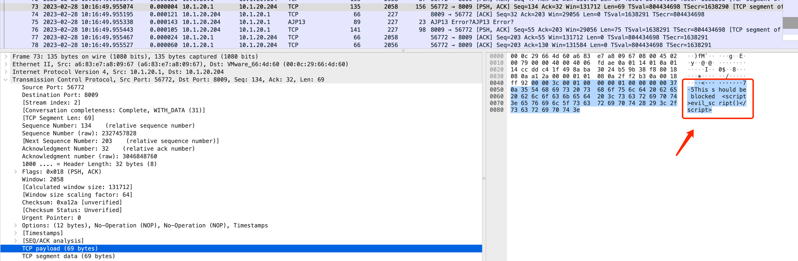

= gRPC HelloWorld
:toc: manual

The objective of this repository is quite simple: to recreate the examples from [here](https://github.com/grpc/grpc-go/tree/master/examples/helloworld) in a docker environment running in localhost.

== Go

=== Run on Localhost

Just execute the following commands:

[source, bash]
.*1. start server*
----
docker run -it --rm --name grpc-server-1 -e PORT=8009 -p 8009:8009 -d cloudadc/grpc-go-greeting:0.1 greeter_server
docker run -it --rm --name grpc-server-2 -e PORT=8010 -p 8010:8010 -d cloudadc/grpc-go-greeting:0.1 greeter_server
----

[source, bash]
.*2. prepare env file*
----
$ docker inspect grpc-server-1 | jq ".[0].NetworkSettings.IPAddress"
"172.17.0.2"
$ docker inspect grpc-server-2 | jq ".[0].NetworkSettings.IPAddress"
"172.17.0.3"

$ echo "ADDRESS=172.17.0.2:8009" > list/env-docker-1.list
$ echo "ADDRESS=172.17.0.3:8010" > list/env-docker-2.list
----

[source, bash]
.*3. run client*
----
$ docker run --env-file ./list/env-docker-1.list cloudadc/grpc-go-greeting:0.1 greeter_client "kylin SONG"
2023/02/28 01:21:04 Greeting: Hello kylin SONG

$ docker run --env-file ./list/env-docker-2.list cloudadc/grpc-go-greeting:0.1 greeter_client "kylin SONG"
2023/02/28 01:21:44 Greeting: Hello kylin SONG
----

[source, bash]
.*4. run client with scripts*
----
$ docker run --env-file ./list/env-docker-1.list cloudadc/grpc-go-greeting:0.1 greeter_client "This should be blocked "
2023/02/28 01:27:42 Greeting: Hello This should be blocked 

$ docker run --env-file ./list/env-docker-2.list cloudadc/grpc-go-greeting:0.1 greeter_client "This should be blocked "
2023/02/28 01:28:01 Greeting: Hello This should be blocked 
----

=== Run on Remote & Capture network packet flow

[source, bash]
.*1. start server*
----
$ docker run -it --rm --name grpc-server-1 -e PORT=8009 -p 8009:8009 -d cloudadc/grpc-go-greeting:0.1 greeter_server

~]# netstat -antulop | grep 8009
tcp        0      0 0.0.0.0:8009            0.0.0.0:*               LISTEN      1912/docker-proxy    off (0.00/0/0)
tcp6       0      0 :::8009                 :::*                    LISTEN      1916/docker-proxy    off (0.00/0/0)
----

[source, bash]
.*2. prepare env file*
----
echo "ADDRESS=10.1.20.204:8009" > list/env-remote.list 
----

[source, bash]
.*3. run client*
----
$ docker run --env-file ./list/env-remote.list cloudadc/grpc-go-greeting:0.1 greeter_client
2023/02/28 02:14:01 Greeting: Hello world

$ docker run --env-file ./list/env-remote.list cloudadc/grpc-go-greeting:0.1 greeter_client "Kylin SONG"
2023/02/28 02:14:10 Greeting: Hello Kylin SONG

$ docker run --env-file ./list/env-remote.list cloudadc/grpc-go-greeting:0.1 greeter_client "This should be blocked "
2023/02/28 02:14:28 Greeting: Hello This should be blocked 
----

*4. Packet Overview*

* link:gRPC-go-hello.pcap[]

=== NGINX in front of gRPC Server

[source, bash]
.*1. NGIINX Configration*
----
upstream grpcgreeting_service {
    zone grpcgreeting_service 64k;
    server 10.1.20.204:8009;
}

server {
    listen 8009 http2;
    status_zone server_grpcgreeting;

    location / {
        status_zone location_grpcgreeting;
       # grpc_pass grpc://grpcgreeting_service;
       grpc_pass 10.1.20.204:8009;
    }
}
----

* link:grpc.conf[grpc.conf]

[source, bash]
.*2. Start NGINX*
----
~]# systemctl restart nginx

~]# netstat -antulop | grep nginx
tcp        0      0 0.0.0.0:8009            0.0.0.0:*               LISTEN      1948/nginx: master   off (0.00/0/0)
----

[source, bash]
.*3. gRPC Client communicate gRPC server via NGINX*
----
$ echo "ADDRESS=10.1.20.203:8009" > list/env-nginx.list

$ docker run --env-file ./list/env-nginx.list cloudadc/grpc-go-greeting:0.1 greeter_client
2023/02/28 02:53:33 Greeting: Hello world

$ docker run --env-file ./list/env-nginx.list cloudadc/grpc-go-greeting:0.1 greeter_client "Kylin SONG"
2023/02/28 02:58:30 Greeting: Hello Kylin SONG

$ docker run --env-file ./list/env-nginx.list cloudadc/grpc-go-greeting:0.1 greeter_client "his should be blocked "
2023/02/28 03:01:18 Greeting: Hello his should be blocked 
---- 

NOTE: The gRPC server run on `10.1.20.204:8009`, the NGINX run on `10.1.20.203:8009`, the gRPC client run on `localhost`.

=== NGINX in front of gRPC Server, App Protect Policy on NGINX

* link:policy.json[policy.json]

== Java

=== Build and Run on Local

